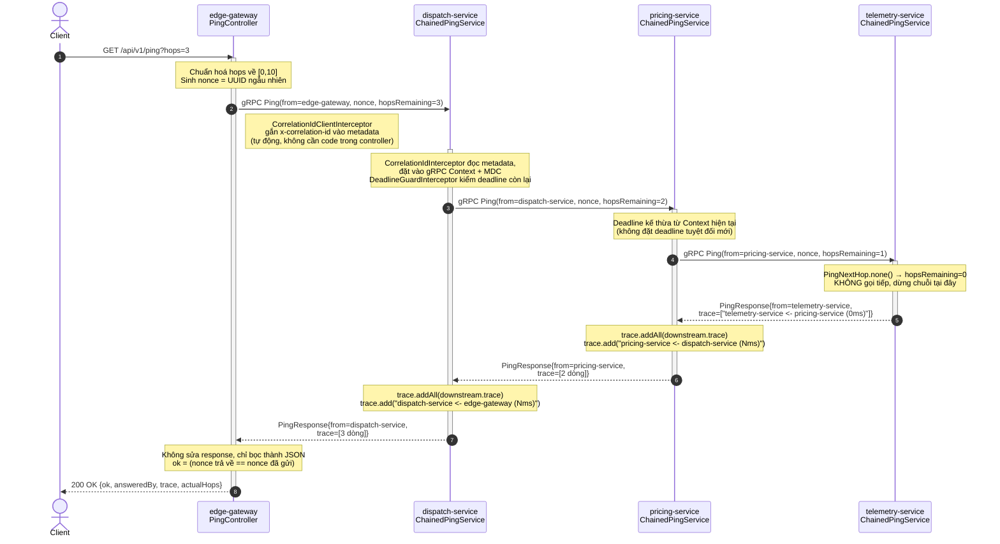
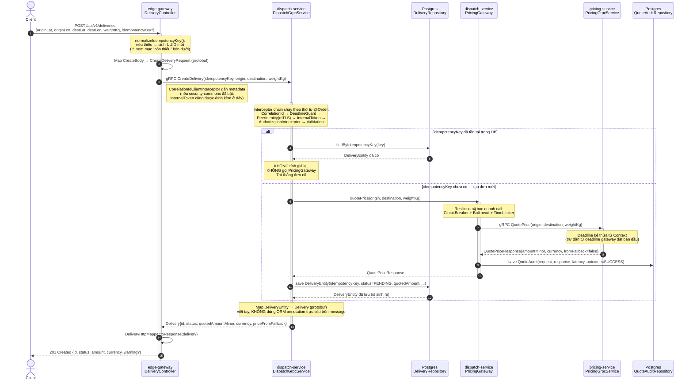
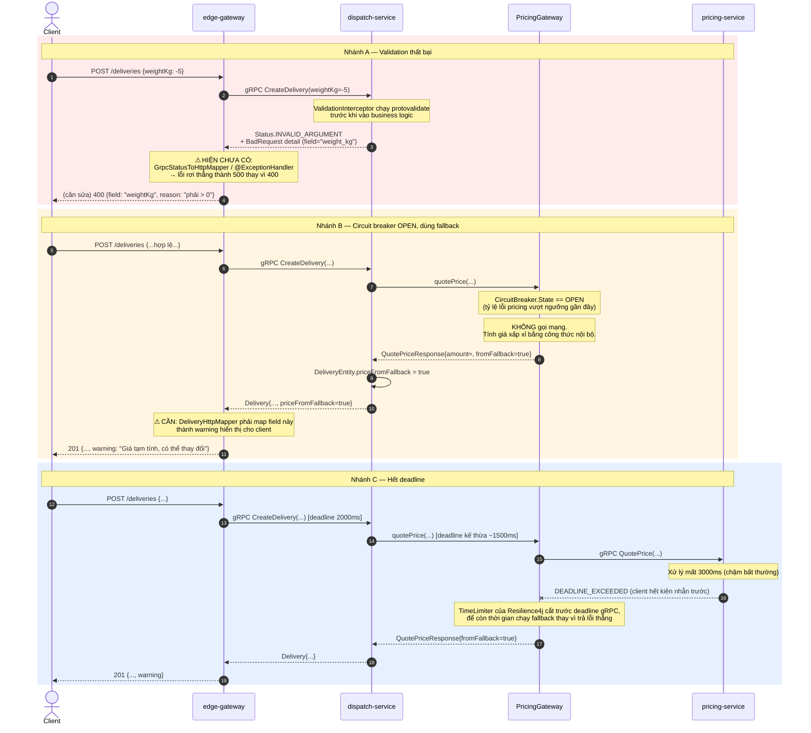

# Vòng đời request — Ping và CreateDelivery

Tài liệu này mô tả chi tiết đường đi thật của hai loại request tiêu biểu trong hệ thống:
`GET /api/v1/ping` (kiểm tra đường dây) và `POST /api/v1/deliveries` (nghiệp vụ chính). Mục
tiêu là để bất kỳ ai đọc code sau này — kể cả chính bạn sáu tháng sau — hiểu được **request đi
qua bao nhiêu tầng, tầng nào làm gì, và khi nào nó có thể vỡ**.

> **Ghi chú về nền tảng gRPC.** `ChainedPingService` đăng ký bằng
> `@org.springframework.grpc.server.service.GrpcService`, tức dự án đang dùng module gRPC chính
> thức của Spring Boot (`spring-grpc`), khác với `net.devh:grpc-spring-boot-starter` dùng trong
> bản khung sườn ban đầu. Khác biệt quan trọng nhất với người đọc code: stub phía client (như
> `DispatchServiceGrpc.DispatchServiceBlockingStub` được inject thẳng vào constructor của
> `DeliveryController`) được Spring tự tạo bean theo cấu hình `spring.grpc.client.*`, không cần
> annotation `@GrpcClient` trên từng field như ở `net.devh`. Nếu phần cấu hình client trong
> `application.yml` đổi tên, các bean stub sẽ đổi theo — kiểm tra ở đó trước khi nghi ngờ code.

---

## 1. Luồng `GET /api/v1/ping` — kiểm tra đường dây

### 1.1 Sequence diagram

### 1.2 Cơ chế implement từng thành phần

**`PingController` (edge-gateway).** Không cài đặt `PingServiceGrpc.PingServiceImplBase` —
nó chỉ là một **gRPC client thuần**, gọi thẳng vào `dispatch-service` qua
`PingServiceGrpc.PingServiceBlockingStub`. Việc gọi được bọc trong
`Mono.fromCallable(...).subscribeOn(Schedulers.boundedElastic())` vì stub kiểu `Blocking` chạy
đồng bộ — nếu gọi trực tiếp trên event loop của WebFlux sẽ chặn toàn bộ reactor thread, nên phải
đẩy sang `boundedElastic` (thread pool riêng cho tác vụ chặn). `.timeout(Duration.ofSeconds(5))`
là lưới an toàn ở tầng reactive, độc lập với deadline gRPC — nếu cả hai đều thiếu, một cuộc gọi
treo sẽ treo cả HTTP response.

**`ChainedPingService` (dùng chung, nạp vào cả 3 service nội bộ).** Đây là điểm dễ gây nhầm lẫn
nhất: **cùng một class, nhưng ba service có ba bean khác nhau** vì `serviceName` và `nextHop`
được truyền qua constructor, lấy giá trị từ `application.yml` riêng của từng service
(`fleetpulse.grpc.service-name`, `fleetpulse.grpc.ping.next-hop`). Cơ chế đệ quy: mỗi service
kiểm `nextHop.isPresent() && hopsRemaining > 0` — nếu đúng thì gọi tiếp xuống, đợi kết quả trả
về, `addAll()` toàn bộ trace của downstream, rồi mới `add()` dòng của chính mình vào cuối. Kết
quả là **response cuối cùng ở service đầu chuỗi mang theo trace của toàn bộ đường đi**, đọc từ
dưới lên đúng theo thứ tự request đã đi qua.

**Số mili-giây trong trace là cộng dồn, không phải delta.** `elapsedMs` đo từ lúc `ping()` bắt
đầu chạy tới lúc chuẩn bị trả lời — bao gồm cả thời gian chờ downstream. Muốn biết thời gian xử
lý *riêng* của một service, phải lấy hiệu số giữa dòng của nó và dòng ngay trước nó trong trace.

**Correlation ID đi xuyên suốt mà không cần code trong `ChainedPingService` hay `PingController`.**
`CorrelationIdClientInterceptor` (đăng ký toàn cục ở tầng client) tự đọc `x-correlation-id` từ
gRPC `Context` hiện tại và gắn vào metadata của call đi ra; `CorrelationIdInterceptor` (tầng
server) tự đọc lại và đặt vào `Context` + MDC. Toàn bộ việc này xảy ra ở lớp interceptor,
business code không biết và không cần biết.

**Vì sao cách này không phù hợp để trace mọi request nghiệp vụ.** Nó chỉ đúng vì `Ping` có tính
chất đặc biệt: một chuỗi tuyến tính, đồng bộ, một response duy nhất quay lại đúng đường đã đi.
Với luồng `CreateDelivery` bên dưới — nơi có gọi song song, có thể lỗi giữa chừng, có retry — mô
hình "nhét trace vào response" sẽ vỡ. Đó là lý do luồng nghiệp vụ dùng cơ chế khác hẳn: OpenTelemetry
span + correlation ID, tách hoàn toàn khỏi response payload (xem mục 3).

---

## 2. Luồng `POST /api/v1/deliveries` — tạo đơn hàng (happy path)

### 2.1 Sequence diagram

### 2.2 Cơ chế implement từng thành phần

**Idempotency ở tầng `dispatch-service`, không phải ở gateway.** Gateway chỉ đảm bảo *có* một
key gửi xuống; việc kiểm tra trùng lặp và trả lại đơn cũ nằm ở `DispatchGrpcService`, dựa vào
unique index trên cột `idempotency_key` trong bảng `deliveries`. Cách bắt trùng đúng là bắt
`DataIntegrityViolationException` từ ràng buộc unique (khi có race condition hai request cùng
key tới gần như đồng thời) rồi `findByIdempotencyKey` lại lần nữa để trả đơn đã được request kia
tạo — **không dùng `SELECT` trước rồi `INSERT` sau** như một điều kiện đơn thuần, vì giữa hai
bước đó vẫn có thể xảy ra race.

**`PricingGateway` là lớp bọc resilience, tách khỏi `DispatchGrpcService`.** Đây là điểm thiết
kế quan trọng: business logic (`DispatchGrpcService`) không biết gì về circuit breaker hay
bulkhead — nó chỉ gọi `pricingGateway.quotePrice(...)` và nhận về một `QuotePriceResponse`. Toàn
bộ quyết định "gọi thật hay dùng fallback" nằm trong `PricingGateway`, được Resilience4j
decorate qua annotation hoặc `Decorators.ofSupplier(...)`. Khi circuit breaker ở trạng thái
`OPEN` (do tỷ lệ lỗi vượt ngưỡng cấu hình), `PricingGateway` không gọi mạng nữa mà trả ngay một
giá ước lượng nội bộ, đặt `fromFallback = true`.

**`QuoteAudit` ghi lại từng lần gọi giá, kể cả khi fallback.** Đây là bảng audit riêng, không
lẫn với bảng `deliveries` — mục đích là để sau này phân tích được circuit breaker đã mở bao
nhiêu lần, fallback được dùng bao nhiêu %, mà không cần lục log. Cột `outcome` phân biệt
`SUCCESS` / `FALLBACK` / `TIMEOUT`.

**Deadline được truyền xuyên 2 hop mà không cần code tường minh ở mỗi tầng.** Gateway đặt
deadline khi tạo request (qua cấu hình `grpc.client.dispatch.deadline` hoặc `.withDeadlineAfter`
tường minh nếu muốn ghi đè theo endpoint); `DeadlineGuardInterceptor` ở `dispatch-service` đọc
`Context.current().getDeadline()`, và khi `PricingGateway` mở call xuống `pricing-service` trong
cùng `Context` đó, gRPC Java tự tính deadline còn lại. Nếu bạn thấy `PricingGateway` đặt một
deadline **tuyệt đối** riêng (`withDeadlineAfter(1500, SECONDS)` không phụ thuộc context hiện
tại), đó là chỗ cần sửa — nó phá vỡ nguyên tắc "trừ dần", có thể khiến pricing vẫn còn thời gian
xử lý dù gateway đã hết hạn từ lâu.

**`DeliveryHttpMapper` là ranh giới giữa hai thế giới.** Nó là nơi duy nhất được phép biết cả
hình dạng của protobuf `Delivery` lẫn hình dạng JSON `DeliveryResponse`. Không entity JPA nào,
không message protobuf nào được serialize thẳng ra HTTP — nguyên tắc này giữ cho việc đổi schema
DB không vô tình trở thành breaking change của REST API.

---

## 3. Luồng lỗi và fallback

### 3.1 Sequence diagram

### 3.2 Ghi chú thiết kế cho các nhánh lỗi

**Nhánh A cho thấy khoảng trống lớn nhất hiện tại.** `DeliveryController` không có
`@ExceptionHandler` hay `@RestControllerAdvice` bắt `StatusRuntimeException`. Khi
`dispatch-service` trả `INVALID_ARGUMENT`, exception đi thẳng ra ngoài và Spring mặc định trả
500 — sai hoàn toàn về mặt HTTP semantics (lỗi do *client* nhập sai, phải là 4xx). Cách sửa
đúng: một `GrpcStatusToHttpMapper` ánh xạ theo bảng chuẩn (`INVALID_ARGUMENT`→400,
`DEADLINE_EXCEEDED`→504, `UNAVAILABLE`→503...), kèm `@RestControllerAdvice` đọc
`BadRequest`/`ErrorInfo` detail từ `google.rpc.Status` để trả về JSON có tên field cụ thể thay
vì một câu message chung chung.

**Nhánh B là lý do trường `from_fallback` tồn tại trong proto.** Nguyên tắc: fallback phải
**trung thực**, không bao giờ âm thầm trả giá sai mà không báo. Nếu `DeliveryHttpMapper` hiện
chưa đọc `priceFromFallback`, đây là việc cần bổ sung ngay — thiếu nó, tài xế hoặc khách hàng sẽ
thấy một mức giá tưởng là chính xác trong khi thực ra là ước lượng lúc hệ thống giá đang gặp sự
cố.

**Nhánh C minh hoạ vì sao `TimeLimiter` và deadline gRPC phải đồng bộ, không mâu thuẫn.** Nếu
`TimeLimiter` của Resilience4j đặt dài hơn deadline gRPC, request vẫn chết ở tầng gRPC trước khi
`TimeLimiter` kịp phản ứng — lúc đó không còn cơ hội chạy fallback nữa. Ngược lại nếu
`TimeLimiter` ngắn hơn hợp lý, `PricingGateway` cắt sớm, còn dư thời gian để tính giá fallback và
trả về cho `dispatch-service` trước khi deadline gốc (do gateway đặt) hết hạn.

---

## 4. Checklist việc cần làm tiếp cho `DeliveryController`

- [ ] Thêm `@RestControllerAdvice` + `GrpcStatusToHttpMapper` ánh xạ `StatusRuntimeException` →
      `ProblemDetail` (RFC 7807) theo bảng ở phụ lục ROADMAP
- [ ] Đặt `.withDeadlineAfter(...)` tường minh trên `dispatchService.createDelivery(request)`,
      nhất quán với cách `PingController` đang làm
- [ ] Thêm `.timeout(Duration.ofSeconds(N))` vào chuỗi `Mono` trong `create()`
- [ ] Đổi `normalizeIdempotencyKey`: khi client không gửi key, cân nhắc sinh key **xác định**
      (ví dụ hash SHA-256 của `origin + destination + weightKg + ngày`) thay vì UUID ngẫu nhiên,
      để retry tự nhiên (không có key) vẫn chống được trùng đơn
- [ ] Thêm Bean Validation (`@Valid` + annotation trên `CreateBody`) để chặn `weightKg <= 0` và
      toạ độ thiếu ngay tại gateway, tránh một round-trip mạng vô ích
- [ ] Kiểm tra `DeliveryHttpMapper.toResponse()` có đọc `priceFromFallback` và trả `warning`
      tương ứng hay chưa
- [ ] Thêm `GET /api/v1/deliveries/{id}`, gọi RPC tương ứng (hiện `dispatch.proto` mới có
      `CreateDelivery`; nếu cần lấy theo id, bổ sung RPC `GetDelivery` vào hợp đồng — nhớ chạy
      `buf breaking` để xác nhận không phá tương thích)
- [ ] Viết test cho từng nhánh lỗi ở mục 3: validation thất bại, circuit breaker mở, deadline
      vượt quá — dùng in-process gRPC server để không phụ thuộc network thật

---

## 5. Bảng tham chiếu nhanh

| Interceptor / thành phần | Order | Chạy ở đâu | Vai trò |
|---|---|---|---|
| `CorrelationIdInterceptor` | 10 | server | Sinh/đọc `x-correlation-id`, đặt vào Context + MDC |
| `CorrelationIdClientInterceptor` | 10 | client | Đọc từ Context, ghi vào metadata call đi ra |
| `DeadlineGuardInterceptor` | 20 | server | Deadline mặc định + từ chối sớm nếu còn lại quá ít |
| `PeerIdentityInterceptor` | 25 | server | Trích danh tính service gọi đến từ SAN cert (mTLS) |
| `InternalTokenInterceptor` | 30 | server | Verify `JwtInternalTokenVerifier`, đặt `InternalPrincipal` |
| `AuthorizationInterceptor` | 40 | server | Tra `GrpcAuthorizationPolicy`, mặc định từ chối |
| `ValidationInterceptor` | 50 | server | Chạy protovalidate trên từng message |
| `PricingGateway` | — | dispatch-service | Bọc resilience quanh call `pricing-service` |
| `GrpcStatusToHttpMapper` | — | edge-gateway | **(cần bổ sung)** map Status → HTTP ProblemDetail |

> Bảng ánh xạ đầy đủ gRPC Status → HTTP nằm ở `ROADMAP.md`, phụ lục A.
